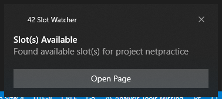
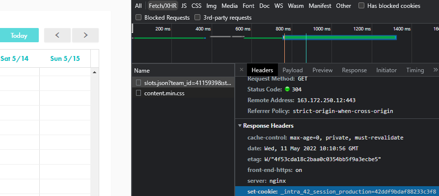

# 42_SlotWatcher
## Description
A very small applet to look for available evaluation slots for School 42's projects. It makes a request to the Intra server at a customizable interval and will push a Windows notification if it finds available slots. Your mileage may vary due to the way the system works. The moment you refresh or enter the evaluation page, you might not find the slot, but it should still be more convenient than continuously pressing F5 to find some open slots.

It's made quickly, so it might not work properly. Use at your own risk.

## Usage
The application reads a config.json file for information. If the file doesn't exist, it will prompt for the following information:

* Project ID: the name of the project as written in the URL

* Team ID: team ID as written in the URL

https&colon;//projects.intra&period;42&period;fr/projects/ <strong>Project ID</strong> /slots?team_id= <strong>Team ID</strong>

* Session ID: the cookie of the your intra login. It's found on the request's header in the project's open slot page. It should be in the format: `"_intra_42_session_production=**Session ID**"`

## Flags
* `-refresh=120` - Set the interval between each refresh in seconds. Default is 120 seconds.
* `-days=2` - Set the range that the program will look for available slots counting from today. Default is 2 days.
* `-help`
